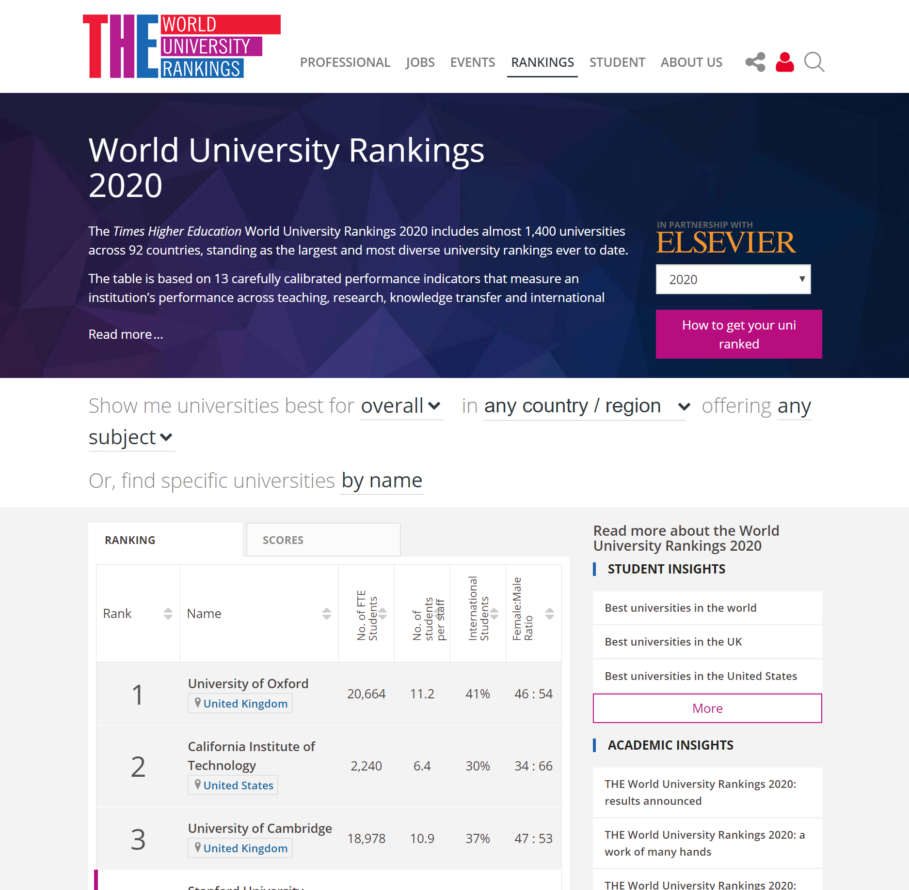
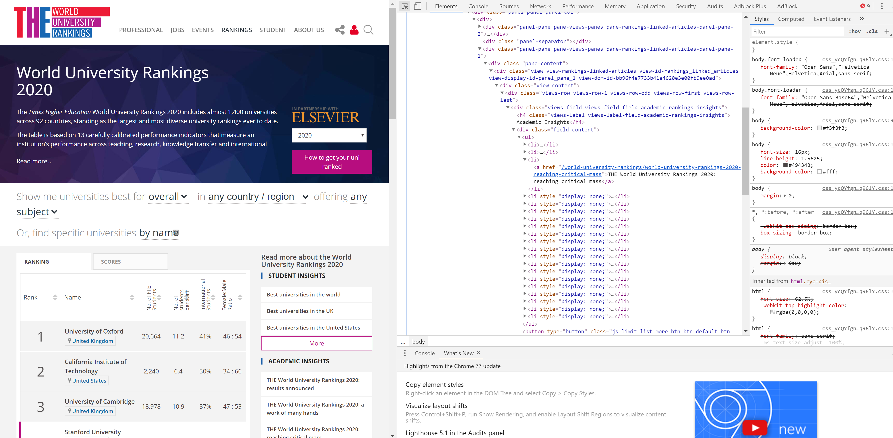

## Aim
This code tries to extract information from a university ranking website. The concept of collecting data from websites is called web scraping and is used mainly to collect data from websites which do not offer an API to collect data natively. 
Several tutorials are available to explain the web scraping basics. This notebook is more of a case study. <br />
Let's start ......  

## 1. Prerequisites
This code assumes that you have python installed on your machine.  Basic knowledge of python is also assumed. Here is a full list of the prerequisites: 
* python 3.6 or above
* Jupyter notebook - or any environment that allows running python
* The following python libraries (BeautifulSoup, Selenium, urllib, objectpath and Pandas) 
* A web browser, I am using chrome 77 here, but you can use other browsers too
* Web driver for the browsers you are using, for chrome and chrome based browsers you can download it from here https://chromedriver.chromium.org/downloads

## 2. What data are you trying to get? 
This is the first question you should ask yourself, before even touching a single key. In our case, we started with the idea of collecting the list of universities with their ranking. To understand how to do so you will need to visit the website itself to understand a bit about it and its webpages. <br/>

The page we are tyring to scrap looked something like this 


<br/> <br/> <br/> 


It is clear that the page contains some sort of a table that hosts the information we are trying to collect. However collecting the information will depend on the HTML code hidden behind what we can see in the browser window. In chrome to display the HTML code simply press F12. The page should look something like this  


<br/> <br/> <br/> 


Using the small inspection cursor you can point at elements of the page and find out which part of the HTML represent them. This important because we will only use the HTML to collect the data and not the displayed page in the browser. Once you have identified the part of HTML corresponds with the information we need then we will start scraping 

## 3. Let's write some python 

A standard method of using python to request internet pages is through the requests library, however in our particular case this approach will not work, because the website uses AJAX to modify the HTML of the page. This means that the HTML code which you will receive by using requests will only contain an empty template of the table and not the information we are trying to collect. To give the JS code a chance to run and populate the table with the information, we use selenium. Selenium uses browsers to request webpages and then collect the HTML after the page is fully loaded, which will allow us to collect the information we need.

```
# import standard libraries
import json
import time

# import third party libraries
import objectpath
import pandas as pd

from bs4 import BeautifulSoup as soup
from urllib.request import urlopen 
from selenium import webdriver
```

Selenium requires a webdriver to access the web browser. It can be installed or used from an executable file directly. In this example we will use the executable file directly, please edit the following code by adding the location of the webdriver. It is recommonded to place it with the code itself.

```
webdriver_location = '***please insert here webdriver location *** /chromedriver.exe'

webdriver_location = 'C:/Users/razek/Desktop/git_pages/World-University-Rankings-Table/chromedriver.exe'
# initiate webdriver
driver = webdriver.Chrome(executable_path = webdriver_location)
```

Defining which web address we are going to use for scrapping is essential for the workflow. A quick inspection of the target web address reveals that changing the length parameter from 25 to -1 will result in collecting all the available universities instead of 25 per page. This should enable us to collect the information we need in one go rather than requesting several web pages. 
Also checking the tabs available on the web page (ranking, scores) reveals more data to be collected. Therefore we will use two web adresses to collect the data, as follows: 

```
url_stats = 'https://www.timeshighereducation.com/world-university-rankings/2020/world-ranking#!/page/0/length/-1/sort_by/rank/sort_order/asc/cols/stats'
url_scores = 'https://www.timeshighereducation.com/world-university-rankings/2020/world-ranking#!/page/0/length/-1/sort_by/rank/sort_order/asc/cols/scores'
```

```
# create two webdriver objects, one for each of the two adresses 
stats_browser = webdriver.Chrome()
scores_browser = webdriver.Chrome()
```

In the follwoing two cells, we will follow the same procedures for each of the two pages as follows: 
* Request the webpage using the webdriver 
* Collect the HTML code of the webpage 
* Use BeautifulSoup to "parse" the HTML. This will enable us to collect spesific pices of code after
* Use "findAll" method to collect the objects which we identified in the HTML code

```
# use the webdriver to request the ranking webpage
stats_browser.get(url_stats)

# collect the webpage HTML after its loading
stats_page_html = stats_browser.page_source

# parse the HTML using BeautifulSoup
stats_page_soup = soup(stats_page_html, 'html.parser')

# collect HTML objects 
rank_obj = stats_page_soup.findAll("td", {"class":"rank sorting_1 sorting_2"})
names_obj = stats_page_soup.findAll("td", {"class":"name namesearch"})
stats_number_students_obj = stats_page_soup.findAll("td", {"class":"stats stats_number_students"})
stats_student_staff_ratio_obj = stats_page_soup.findAll("td", {"class":"stats stats_student_staff_ratio"})
stats_pc_intl_students_obj = stats_page_soup.findAll("td", {"class":"stats stats_pc_intl_students"})
stats_female_male_ratio_obj = stats_page_soup.findAll("td", {"class":"stats stats_female_male_ratio"})

# close the browser
stats_browser.close() 
```

```
# use the webdriver to request the scores webpage
scores_browser.get(url_scores)

# collect the webpage HTML after its loading
scores_page_html = scores_browser.page_source
scores_page_soup = soup(scores_page_html, 'html.parser')

# parse the HTML using BeautifulSoup
overall_score_obj = scores_page_soup.findAll("td", {"class":"scores overall-score"})
teaching_score_obj = scores_page_soup.findAll("td", {"class":"scores teaching-score"})
research_score_obj = scores_page_soup.findAll("td", {"class":"scores research-score"})
citations_score_obj = scores_page_soup.findAll("td", {"class":"scores citations-score"})
industry_income_score_obj = scores_page_soup.findAll("td", {"class":"scores industry_income-score"})
international_outlook_score_obj = scores_page_soup.findAll("td", {"class":"scores international_outlook-score"})

# close the browser
scores_browser.close() 
```

Once the HTML objects are collected, then we can start extracting the data from them. The data will be presented eventually in pandas dataframe, which can be presented as a table. Pandas dataframe can be constructed using lists of equal length. In the follwoing two cells we will extract/collect the data using two differnet methods


#### Extracting data from HTML objects: 


```
rank, names, number_students, student_staff_ratio, intl_students, female_male_ratio, web_address =  [], [], [], [], [], [], []
overall_score, teaching_score, research_score, citations_score, industry_income_score, international_outlook_score = [], [], [], [], [], []
for i in range(len(names_obj)):
    web_address.append('https://www.timeshighereducation.com' + names_obj[i].a.get('href'))
    rank.append(rank_obj[i].text)
    
    names.append(names_obj[i].a.text)
    number_students.append(stats_number_students_obj[i].text)
    student_staff_ratio.append(stats_student_staff_ratio_obj[i].text)
    intl_students.append(stats_pc_intl_students_obj[i].text)
    female_male_ratio.append(stats_female_male_ratio_obj[i].text[:2])
    
    overall_score.append(overall_score_obj[i].text)
    teaching_score.append(teaching_score_obj[i].text)
    research_score.append(research_score_obj[i].text)
    citations_score.append(citations_score_obj[i].text)
    industry_income_score.append(industry_income_score_obj[i].text)
    international_outlook_score.append(international_outlook_score_obj[i].text)
```

```
full_address_list, streetAddress_list, addressLocality_list, addressRegion_list, postalCode_list, addressCountry_list  = [], [], [], [], [], []
for web in web_address:
    page = urlopen(web)
    page_html = soup(page, 'html.parser')
    location = page_html.findAll('script', {'type':"application/ld+json"})
    jt = json.loads(location[0].text)
    jsonnn_tree = objectpath.Tree(jt)
    streetAddress_list.append(list(jsonnn_tree.execute('$..streetAddress'))[0])
    addressLocality_list.append(list(jsonnn_tree.execute('$..addressLocality'))[0])
    addressRegion_list.append(list(jsonnn_tree.execute('$..addressRegion'))[0])
    postalCode_list.append(list(jsonnn_tree.execute('$..postalCode'))[0])
    addressCountry_list.append(list(jsonnn_tree.execute('$..addressCountry'))[0])
    full_address = page_html.findAll('div', {'class':"institution-info__contact-detail institution-info__contact-detail--address"})[0].text.strip()
    full_address_list.append(full_address)
    print ('{} out of {}'.format(len(full_address_list), len (web_address)), full_address)
```

```
df = pd.DataFrame({
    'rank' : rank,
    'name' : names,
    'number_students' : number_students,
    'student_staff_ratio' : student_staff_ratio,
    'intl_students' : intl_students,
    'female_male_ratio' : female_male_ratio,
    'overall_score' : overall_score,
    'teaching_score' : teaching_score,
    'research_score' : research_score,
    'citations_score' : citations_score,
    'industry_income_score' : industry_income_score,
    'international_outlook_score' : international_outlook_score,
    'address' : full_address_list, 
    'street_address' : streetAddress_list,
    'locality_address' : addressLocality_list,
    'region_address' : addressRegion_list,
    'postcode_address' : postalCode_list,
    'country_address' : addressCountry_list
})
df
```

```
df['intl_students'] = df['intl_students'].str.replace(pat='%', repl='')
df['rank'] = df['rank'].str.replace(pat='\–\d*|\+', repl='', regex=True)
df['overall_score'] = df['overall_score'].str.replace(pat='.*\–', repl='', regex=True)
df['number_students'] = df['number_students'].str.replace(pat=',', repl='', regex=True)
df = df.replace('n/a*', pd.np.nan, regex=True)
df
```

```
df.to_csv('uni_02.csv', encoding='utf-16', index=False)
```